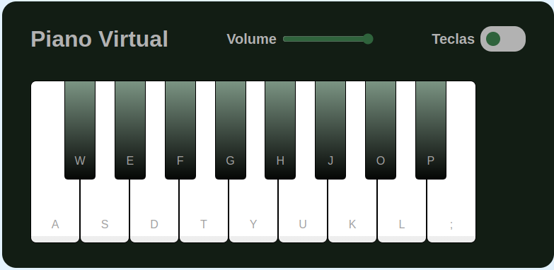
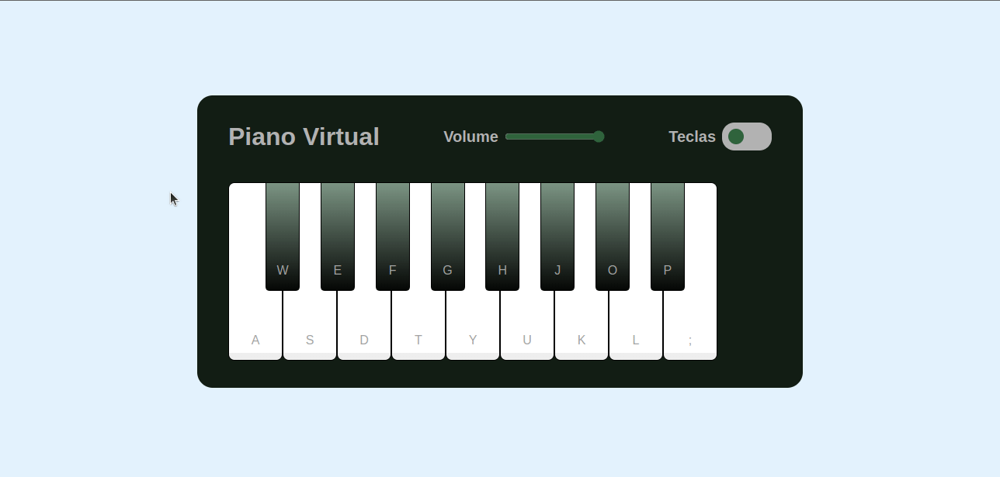

## FSM Piano Virtual

## 🛠 Tecnologias Utilizadas

## 💻 Sobre o simulador

Simulador de piano com controle de volume

## Instalação e execução

1. Faça o download do projeto clicando em **Code** e em seguida em **Download Zip**.

2. Extraia a pasta zipada.

3. Execute o arquivo index.html.
